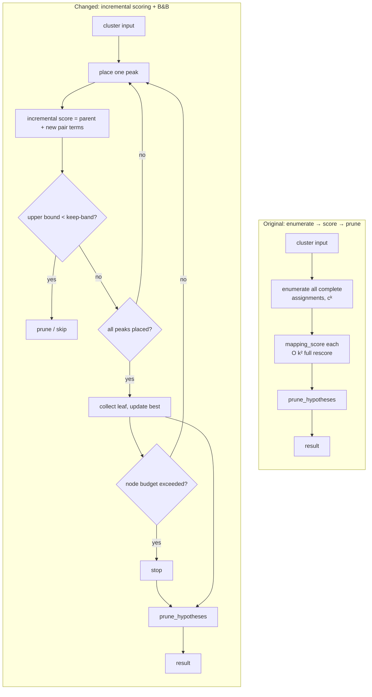
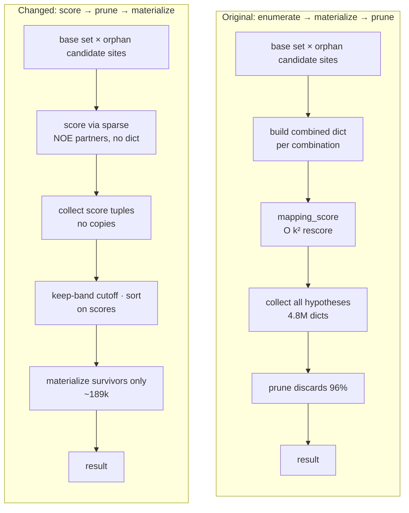

# MAGIC — Refactoring & Performance Optimization

Changes relative to the original program. Every optimization is **output-preserving**
(assignments byte-identical; `best_score` differs by at most 2×10⁻¹³ due to
floating-point summation order).

- Target: methyl-NMR automated assignment pipeline (Monneau et al. 2017, MAGIC)
- Scope: (1) structural refactoring, (2) algorithmic performance optimization
- Verification: real protein structures (1UBQ, 1ANF/MBP, 1D8C) confirm byte-identical output

---

## 1. Summary

| Aspect | Original | After |
|---|---|---|
| Structure | root `magic_config.py` (356-line grab-bag) + 2 duplicate wrappers; package reaches back to root module | cohesive package modules, back-reference removed |
| `solve_local_cluster` | enumerate all assignments → O(k²) rescore each | incremental scoring + branch-and-bound pruning |
| `merge_hypothesis_sets` | O(k²) full rescore per merge | incremental (base.score + new-peak terms) |
| orphan assignment | enumerate → build every dict → prune | score first → prune → materialize survivors only |
| compatibility check | rebuild `Counter(base)` per pair | once per base |

### Performance (real proteins, "Original" = pre-optimization)

| Dataset | methyl peaks | Original | After | Speedup |
|---|---|---|---|---|
| 1UBQ (ubiquitin) | 43 | 143.5 s | **7.5 s** | 19× |
| 1ANF (MBP) | 192 | did not finish (>150 s, non-terminating in practice) | **19.2 s** | now tractable |
| 1D8C | 369 | did not finish (non-terminating in practice) | **21.9 s** | now tractable |

The original did not terminate on medium/large proteins because of combinatorial
blow-up. After the changes all datasets finish, with identical output.

---

## 2. Structural Refactoring

### 2.1 File reorganization

```
[Original]                          [After]
magic_config.py  (356 lines, root) ─┬─▶ magic/config.py   control-file parsing + template
                                    └─▶ magic/inputs.py   path resolve / validate / output-dir naming
                                        magic/cli.py      argparse (moved out of config)
Magic3v1.py      (wrapper)         ───▶ Magic3v1.py       kept (backward compatible)
magic_runner.py  (dup wrapper)     ───▶ (deleted)
                                        magic/__main__.py new (python -m magic)
```

- The package used to `import` root `magic_config` (`cli.py`, `io.py`, `pipeline.py`,
  `search.py`); all back-references converted to package-internal imports.
- Import graph is now unidirectional: `config ← inputs ← {cli, io, pipeline}`, no cycles.

### 2.2 Dead code removed (7)

`methyl_residue_id`, `assignment_residue_id`, `atom_residue_id`, `atom_name`,
`temp_file_peak_id`, `should_run_isolated_pass`, `ensure_runtime_dependencies` — zero
references. Only the actually-used `generic_residue_id` was inlined into its sole
consumer `search.py`.

### 2.3 Entry points

- `python -m magic run|validate|template ...` (new, `magic/__main__.py`)
- `python Magic3v1.py ...` (kept)
- Legacy positional style `Magic3v1.py control.txt outdir` still works.

---

## 3. Algorithmic Optimization

The original phase order (network build → local clusters → merge → orphan assignment)
is unchanged. What changed is the **computation order inside each phase** — see 3.1–3.3.

### 3.1 `solve_local_cluster` — enumerate-then-score → incremental scoring + B&B

**Original:** enumerate **every** complete assignment of a cluster, then rescore each
with `mapping_score` at **O(k²)**. With k peaks and c candidate sites, enumeration is
exponential (cᵏ) and every leaf costs O(k²) to rescore.

**Changed:**
1. **Incremental scoring** — place peaks one at a time via backtracking, adding only the
   pairwise terms against already-placed peaks. Removes the O(k²) rescore per leaf.
2. **Branch-and-bound** — prune a partial assignment when its optimistic upper bound (all
   terms ≥ 0, so admissible) cannot reach the keep-band applied by `prune_hypotheses`.
   Since the running-best cutoff ≤ final cutoff, the **surviving hypothesis set is identical**.
3. **Node budget** (`SOLVE_NODE_BUDGET = 1,000,000`) — cap on leaf count so a
   pathologically dense, poorly-differentiated cluster degrades gracefully instead of
   hanging. Real-protein clusters (max size ~6) never hit the cap → result unchanged.

### 3.2 `merge_hypothesis_sets` — O(k²) rescore → incremental

**Original:** for each base × extra pair, build the combined mapping and compute
`mapping_score` from scratch at **O(k²)**.

**Changed:** `combined.score = base.score + (self terms of new peaks + their cross terms
with the base)`. Few new peaks → O(|base|); for a single-peak orphan → O(|base|) vectorized.
Values identical.

Additionally, the compatibility check `mappings_are_compatible` rebuilt
`Counter(base.values())` for every pair; now computed once per base (`_compatible_with_usage`).

### 3.3 orphan assignment — enumerate-then-prune → score-then-materialize (key change)

**Original:** for each orphan, build **every** base × candidate-site combination **as a full
mapping dict**, then prune. Measured (1D8C): the orphan phase built **4.8M hypotheses,
copying 582M dict items** — 96% of which prune discards.

**Changed (`_merge_single_peak`):**
1. **Score first** — build only `(score, length, base, site)` tuples, no dict copies. An
   orphan interacts only with its (sparse) NOE partners, so each base contributes a handful
   of terms.
2. **Apply the keep-band to scores** — reproduce `prune_hypotheses`' cutoff/sort on the
   score tuples.
3. **Materialize survivors only** — build a full mapping for the ≤ `max_keep` surviving
   candidates. Dict construction 4.8M → ~189k.

**Correctness argument:** an orphan peak is never present in any base hypothesis (verified
across all 369 merges → all combined mappings distinct → dedup is a no-op). If a base ever
contained the orphan (never observed), the code falls back to the safe materialize-then-prune path.

### 3.4 Per-phase effect (measured)

| phase | 1ANF (MBP) Original | After | 1D8C Original | After |
|---|---|---|---|---|
| solve_local | (non-terminating) | 11.1 s | 0.0 s | 0.0 s |
| merge_clusters | (non-terminating) | 4.0 s | 0.0 s | 0.0 s |
| **assign_orphans** | (non-terminating) | **3.4 s** | 114 s | **17 s** |
| network | 0.7 s | 0.7 s | 6.5 s | 6.5 s |

*MBP original does not terminate in merge/orphan. 1D8C has 0 clusters (sparse), so
solve/merge are 0 and all cost concentrates in the orphan phase.*

---

## 4. Computation-order comparison flowcharts

Phase order is unchanged, but the **computation order inside solve / merge-orphan** changed.

### 4.1 `solve_local_cluster`



### 4.2 orphan assignment (`merge_hypothesis_sets` single-peak path)



---

## 5. Verification method

- **Output equivalence:** run the original (uses `mapping_score` everywhere) and the changed
  version on the same input → `assignments.tsv` byte-identical. Only `best_score` in
  `summary.json` differs by ≤ 2×10⁻¹³ (floating-point summation order; assignment unchanged).
- **Data:** methyl-NOESY data synthesized from real protein structures (real coordinates,
  1/r⁶ intensities). Small (1UBQ), medium (1ANF), large (1D8C).
- **Regression:** 3-peak synthetic data and the multi-peak cluster-merge path verified to work.

## 6. Remaining bottlenecks (for reference)

- 1ANF: `solve_local` 11 s (B&B) is the largest.
- 1D8C: `assign_orphans` 17 s + `network` 6.5 s.
- Next candidate is `network`'s O(n²) matrix build. Parallelization has limited effect
  because the dominant phase is a sequential accumulation (orphan) — measured: parallelizing
  solve alone gives MBP 1.25×, 1D8C 0×.
